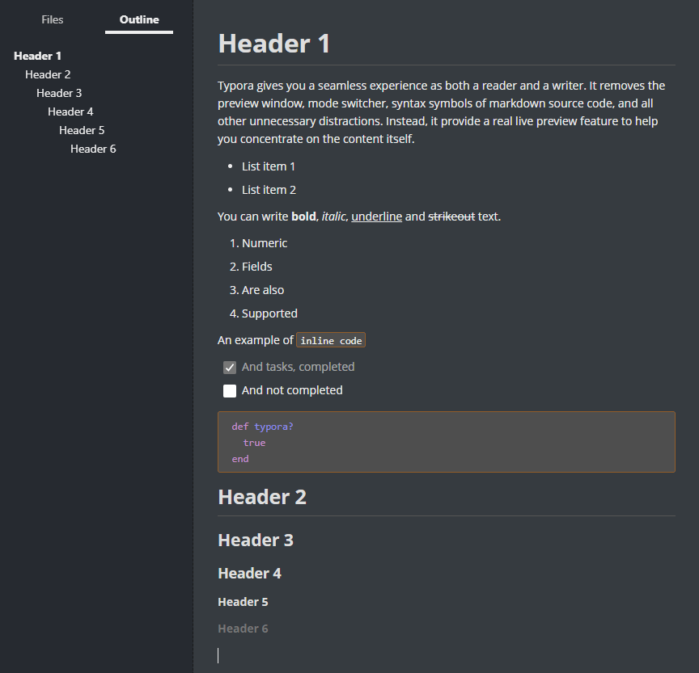

# Dark 'n Nice Theme for Typora

## How to install

Simply move `typora-feels-good.css` and `typora-feels-good` folder into Typora's theme folder.

A complete tutorial is available on [Typora's support](https://support.typora.io/About-Themes/)

## Requirement

This theme is based on default theme `night` and `github`, these themes must be installed in order to use this theme.

## Notes

Every feature available in Typora was not tested. There may still be mistakes in this theme, feel free to open an issue if anything looks terrible.
